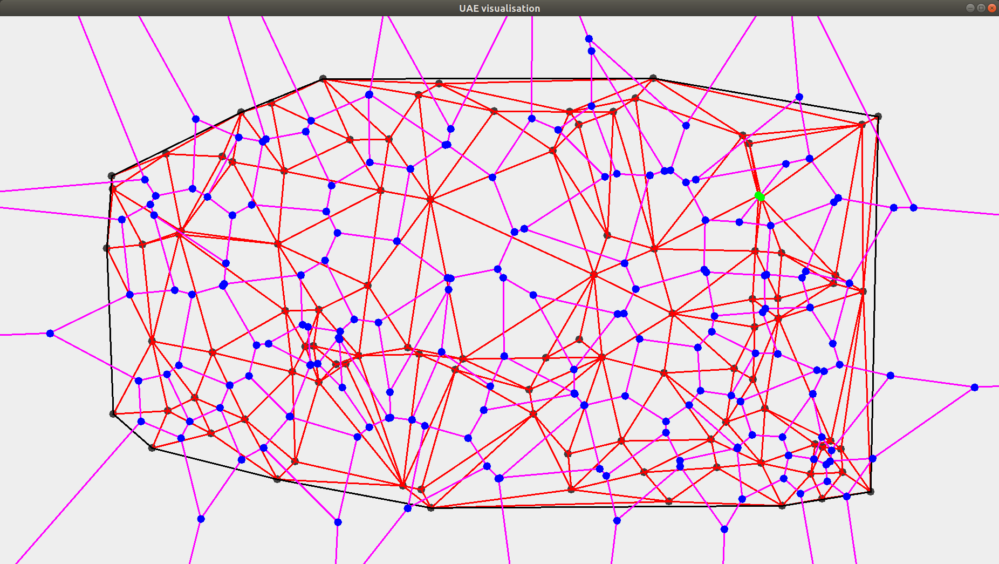

# Computational-geometry

Divide-and-conquer algorithm parallelization framework and efficient algorithm for convex hull problem
based on concatenable queue data structure.

## Parallelization framework

The divide-and-conquer algorithm structure is formalized in `DaCAlgorithm` interface with following methods

```
precompute          perform input data precomputation
divide              divide given problem into two subproblems
merge               merge solutions for a pair of subproblems
isBaseCase          determines if an input is a base case for the algorithm
solveBaseCase       computes solution for the base case input
inputSize           determines input data size (auxilary function for load balancing)
```

An algorithm can be executed either sequentially with `SequentialDaCExecutionSpecifics` or
in parallel with `ParallelDaCExecutionSpecifics`. Creating and managing threads is delegated to 
the `ForkJoinPool`.

## Algorithm

This project provides efficient algorithm for convex hull problem on a static set of points.

The concatenable queue implementation in this project is mainly derived from A. V. Aho and 
J. E. Hopcroft. The Design and Analysis of Computer Algorithms. Addison-Wesley Longman 
Publishing Co., Inc., Boston, MA, USA, 1st edition, 1974.

## Demo

### Download

First navigate to the working directory you want the project to be in.
Then download the source code with

```
git clone https://github.com/SChudakov/computational-geometry.git
```

### Build

After that navigate to the project directory with

```
cd computational-geometry
```

and build the project with

```
mvn clean compile assembly:single
```

This will create `geometry.jar` archive in the `target` subdirectory of the project directory.

### Run

Start the demo by running


Windows         `java -jar target\geometry.jar` 

Linux / Darwin  `java -jar target/geometry.jar` 

The following window will appear.



Type in number of points in the text field, press `Generate` and `Build` to generate new set of points
and build a convex hull for them.